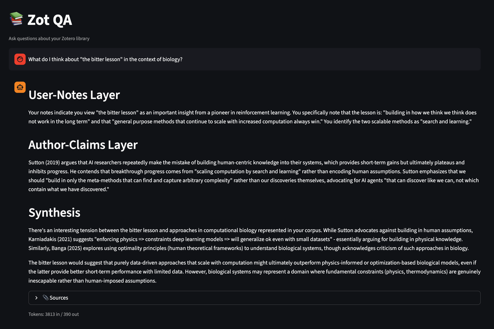

# zotqa

**Query your own Zotero notes and library 📚**

A minimal tool for querying your Zotero library with LLM assistance. Ask questions about papers you've read and notes you've taken.



## Features

- **Two-layer answers**: Every response separates your notes (your interpretations) from author claims (paper content)
- **Provenance tracking**: See exactly which chunks were used to generate each answer
- **Notes-first retrieval**: Prioritizes your notes over paper abstracts
- **LLM-agnostic**: Pluggable embedding and LLM backends (Voyage AI, OpenAI, Anthropic)
- **Single LLM call**: Optimized for one generation call per query

## Requirements

It assumes Zotero is setup to save the .pdf of the papers in your library locally (e.g., in `~/Zotero/storage/`).

## Platform Support

**zotqa** works cross-platform on Linux, macOS, and Windows.

**Windows-specific notes:**
- PDFs are copied instead of symlinked (symlinks require admin privileges on Windows)
- Config files are stored in `%APPDATA%\zotqa\prompts\` instead of `~/.config/zotqa/`
- Index is stored in `%LOCALAPPDATA%\zotqa\index\` instead of `~/.zotqa/index/`
- Default Zotero paths work with standard installations (`C:\Users\<username>\Zotero\`)

## Installation

```shell
# Clone and install
git clone https://github.com/yourusername/zotqa.git
cd zotqa
poetry install

# Install with embedding provider support
poetry install -E voyage  # For Voyage AI embeddings
poetry install -E openai  # For OpenAI embeddings
poetry install -E all     # For all providers (includes both embedding providers)
```

## Configuration

Set your API keys as environment variables:

```**bash**
# For embeddings (choose one)
export VOYAGE_API_KEY="your-voyage-key"
# OR
export OPENAI_API_KEY="your-openai-key"

# For LLM (Claude)
export ANTHROPIC_API_KEY="your-anthropic-key"
```

## Usage

### 1. Export your Zotero library

```bash
# Export all papers and notes
zotqa export ./corpus

# Custom Zotero paths
zotqa export ./corpus --db ~/Zotero/zotero.sqlite --storage ~/Zotero/storage
```

This creates:
```
corpus/
├── index.json
└── papers/<key>/
    ├── metadata.json   # title, year, authors, abstract, tags
    ├── notes.md        # your notes (if any)
    └── paper.pdf       # symlink to original (copy on Windows)
```

### 2. Build the vector index

```bash
# Auto-detect embedding provider
zotqa index ./corpus

# Specify provider
zotqa index ./corpus --embedding-provider voyage
zotqa index ./corpus --embedding-provider openai

# Custom index location
zotqa index ./corpus --index-dir ~/.zotqa/my-index

# Force full rebuild (ignore incremental updates)
zotqa index ./corpus --force

# Skip PDF body extraction (only index notes, abstract, metadata)
zotqa index ./corpus --no-pdf

# Check index statistics
zotqa info
zotqa info --index-dir ~/.zotqa/my-index
```

### 3. Ask questions

```bash
# Basic query
zotqa ask "What do my notes say about protein folding?"

# Filter to specific papers
zotqa ask "What are the key findings?" --paper PAPER001 --paper PAPER002

# Control output
zotqa ask "Summarize the main themes" --max-chunks 15 --max-tokens 4096

# JSON output for programmatic use
zotqa ask "What papers discuss transformers?" --json

# Quiet mode (answer only)
zotqa ask "What is the main contribution?" -q
```

### 4. Use the Web UI (optional)

```bash
# Launch interactive web interface
zotqa ui
```

This opens a Streamlit-based chat interface in your browser where you can:
- Ask questions through an interactive chat interface
- See source citations with similarity scores for each answer
- Track token usage per query

The web UI provides the same two-layer answer structure and provenance tracking as the CLI, but in a more interactive format.

## Customization

### Custom Prompts

You can customize the system and user prompts that guide the LLM's responses.

```bash
# Initialize user prompts (copies defaults to ~/.config/zotqa/prompts/)
zotqa init-prompts

# Overwrite existing custom prompts
zotqa init-prompts --force
```

This creates editable copies at `~/.config/zotqa/prompts/`:
- `system.md` - System prompt defining the assistant's behavior
- `user.md` - User prompt template (with `{context}` and `{question}` placeholders)

Once initialized, zotqa will use your custom prompts instead of the defaults. Edit these files to change how the assistant structures answers, handles citations, or responds to queries.

## Answer Structure

Every answer follows a two-layer format:

```
## User-Notes Layer
[Your notes and interpretations about the topic]

## Author-Claims Layer
[What the papers claim, with citations like [Smith (2023)|abstract]]

## Synthesis (optional)
[When comparing multiple papers]
```

If evidence is insufficient, the tool clearly states "Insufficient evidence in corpus" rather than speculating.

## Example Session

```bash
$ zotqa ask "What did I note about attention mechanisms?"

## User-Notes Layer
Your notes highlight that attention mechanisms enable models to focus on relevant
parts of input sequences [Lee (2024)|notes]. You found this particularly interesting
for DNA sequence analysis applications.

## Author-Claims Layer
The paper "Transformers for Genomics" demonstrates that transformer models with
self-attention can effectively process genomic sequences [Lee (2024)|abstract].

---
Used chunks:
  [Lee (2024) | PAPER003 | notes] (score: 0.892)
  [Lee (2024) | PAPER003 | abstract] (score: 0.756)

Tokens: 1245 in / 187 out
```

## Development

```bash
# Run tests
poetry run pytest

# Format code
poetry run black src/
poetry run ruff check --fix src/

# Type checking
poetry run mypy
```

## License

MIT
